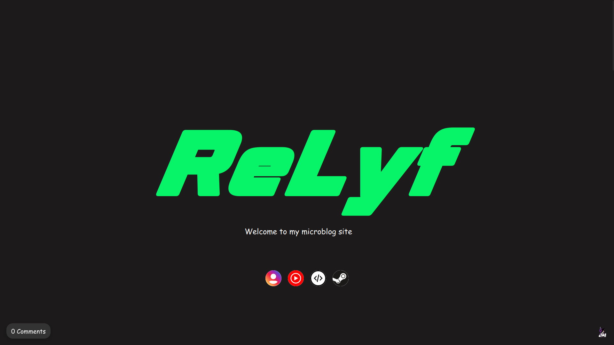

# ReLyf Website



Personal website and media archive created by ReLyf.

## About

This website serves as a personal hub featuring:

* Anime collection
* Manga collection
* Game collection
* Personal projects
* Media recommendations
* Miscellaneous content

## Features

* Responsive design
* Dynamic content loading
* Search and filtering
* Randomized banners and artwork
* Steam game integration
* Anime and manga database support
* Disqus comment sections

## Technologies Used

* HTML5
* CSS3
* JavaScript
* JSON data sources
* GitHub Pages

## Privacy

This website does not directly collect personal information.

Comments are provided through Disqus, which may collect cookies, IP addresses, and other information according to their own privacy policy.

Disqus Privacy Policy:
https://help.disqus.com/en/articles/1717103-disqus-privacy-policy

Third-party services loaded by this website may also have their own privacy practices.

## Local Development

Clone the repository:

```bash
git clone https://github.com/USERNAME/REPOSITORY.git
```

Open the project folder:

```bash
cd REPOSITORY
```

Launch a local web server:

```bash
python -m http.server 8000
```

Then visit:

```text
http://localhost:8000
```

## Contributing

This is primarily a personal project. Issues and suggestions are welcome.

## License

Unless otherwise stated, all original code in this repository is provided under the MIT License.

Media assets, images, trademarks, and third-party content remain the property of their respective owners.
